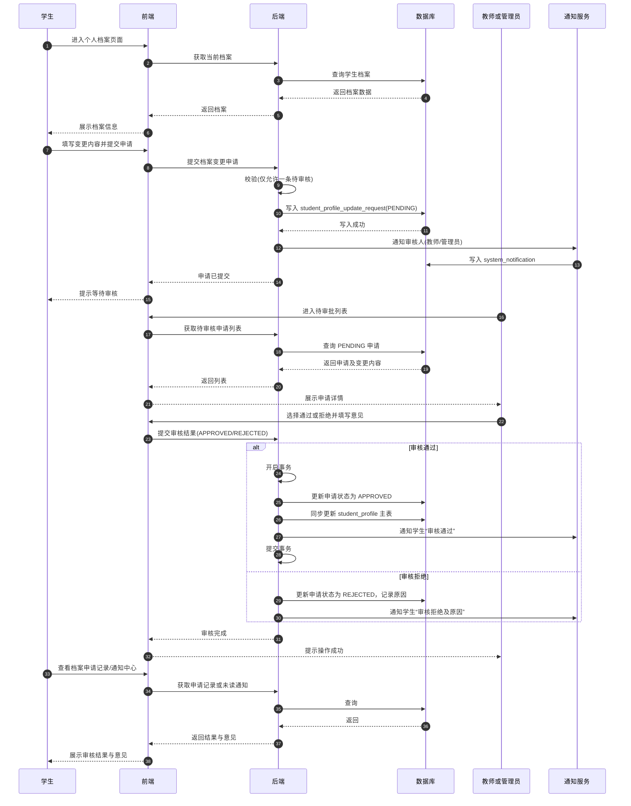
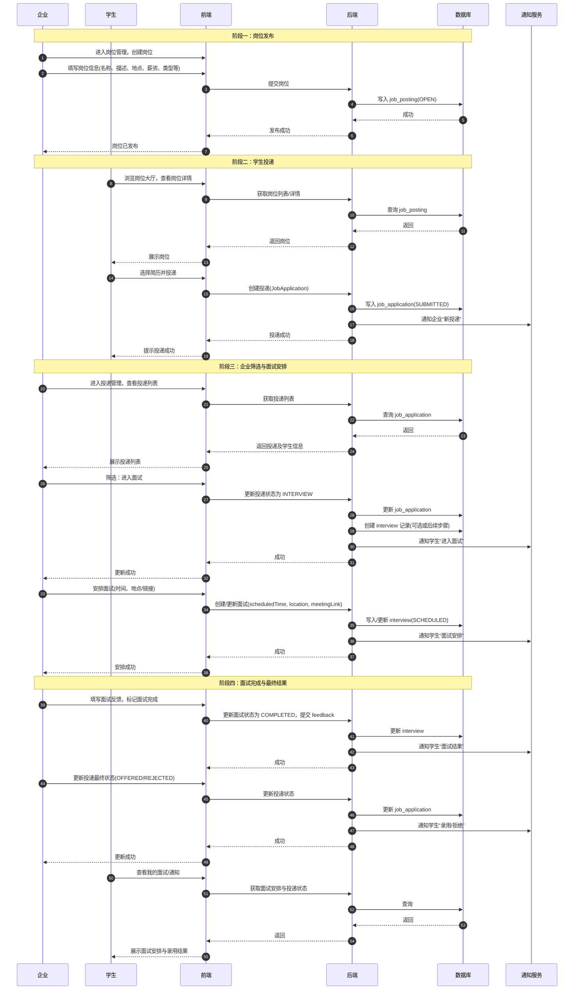
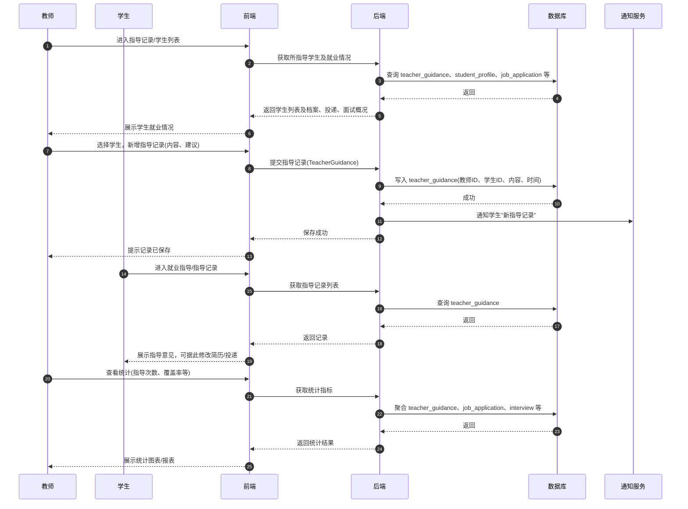
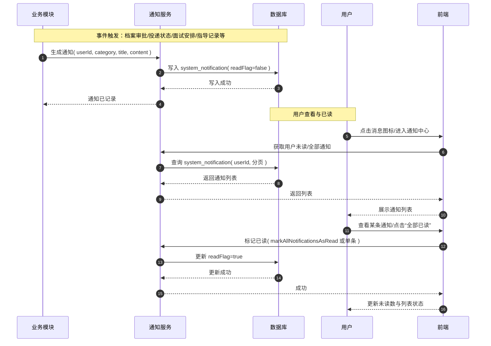
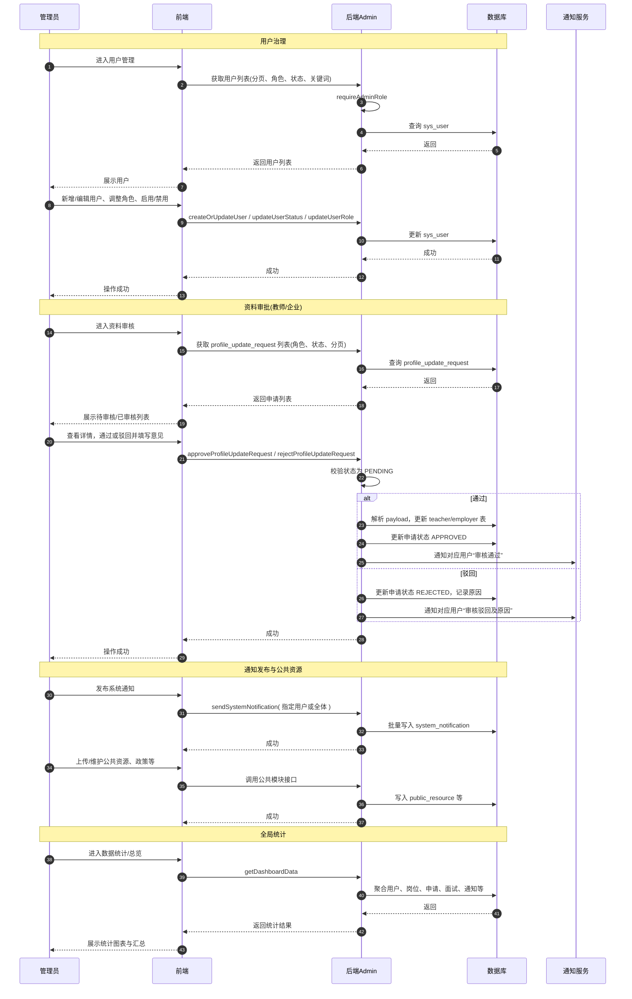

# 高校就业管理系统 - 业务时序图

以下时序图使用 Mermaid 语法编写，可在 [Mermaid Live Editor](https://mermaid.live/) 中粘贴渲染后导出为 PNG/SVG，插入论文使用。

---

## 图3-1 学生档案变更申请—审核—生效流程（流程3-1）



---

## 图3-2 岗位发布—投递—筛选—面试—反馈流程（流程3-2）



---

## 图3-3 就业指导记录—沉淀—统计分析流程（流程3-3）



---

## 图3-4 通知触达流程（支撑流程3-4）



---

## 图3-5 管理员治理流程（支撑流程3-5）



---

## 使用说明

1. **在线渲染**：复制上述任意一个 ` ```mermaid ` 代码块（不含“图3-x”标题），粘贴到 [Mermaid Live Editor](https://mermaid.live/) 中即可生成时序图，可导出 PNG/SVG。
2. **插入论文**：导出图片后，在 Word 中插入图片，图题格式示例：“图3-1 学生档案审批业务时序图”。
3. **分图保存**：建议每个流程单独复制到一个 Mermaid 文档中渲染并导出，便于按图号插入论文对应位置。
